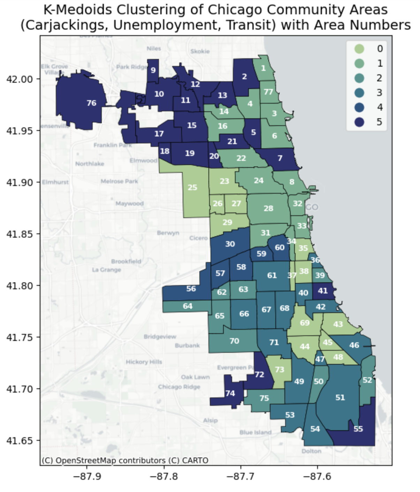
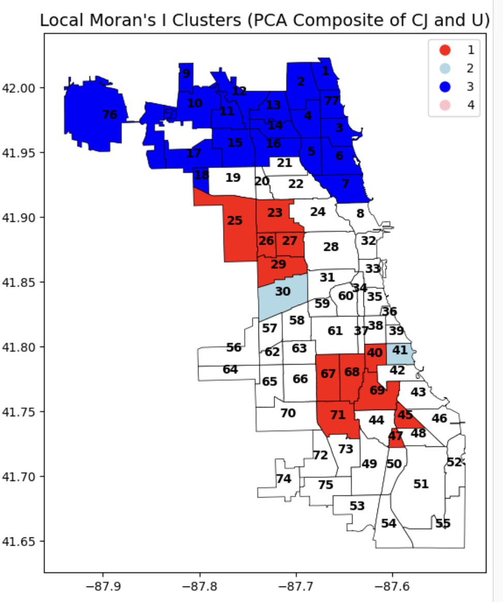
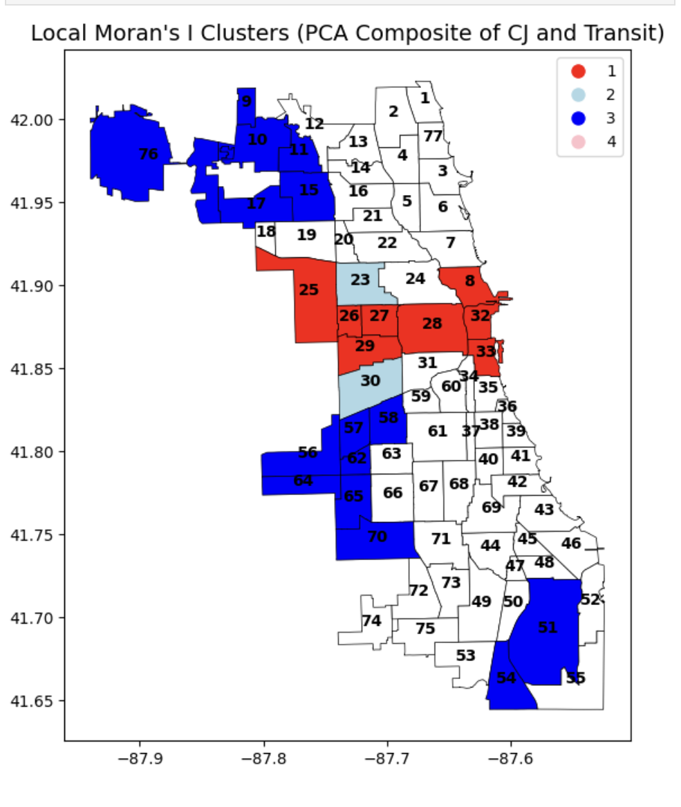

# Spatial Analysis of Carjackings in Chicago

## Overview

This project explores the spatial relationships between carjacking rates, unemployment levels, and transit accessibility across Chicago’s community areas. Using a combination of clustering and spatial autocorrelation methods, I examined how socio-economic and infrastructural variables shape the spatial distribution of carjacking incidents.

## Research Question

Do clusters of carjackings in Chicago relate to local unemployment rates and transit accessibility, and how do these patterns vary across neighborhoods?

## Dataset

- **Chicago Community Area Boundaries**  
- **Carjacking Incident Reports (2023)**  
- **Unemployment Rates by Community Area (ACS 5-Year Estimates)**  
- **CTA L-Station Density (OpenMobilityData)**  

All spatial datasets were projected into EPSG:4326 for consistency.

## Methods

### Spatial Mapping

To start, choropleth maps were used to visualize:

- Carjacking rates per square mile  
- Unemployment rates  
- L-station density per square mile  

These maps helped reveal general patterns, such as the concentration of high carjacking rates in West Garfield Park, East Garfield Park, and North Lawndale—areas that also experience high unemployment or moderate transit access.

### Multivariate Local Moran’s I (PCA-Based)

I computed PCA components to reduce dimensionality and better assess spatial clustering patterns using Local Moran’s I. Three variations were analyzed:

1. **Carjackings + Unemployment**  
2. **Carjackings + Transit Accessibility**  
3. **Carjackings + Unemployment + Transit (Full Composite)**  

The Local Moran’s I statistic was computed using K-nearest neighbors (KNN) weights with *k = 8*, which outperformed Queen contiguity in accuracy. Queen-based spatial weights grouped areas that lacked meaningful spatial similarity. The KNN approach allowed for more localized and accurate neighborhood comparison.

### K-Medoids Clustering

To classify neighborhoods into socio-spatial groups, K-Medoids clustering was applied using carjacking rate, unemployment rate, and transit access. The optimal number of clusters (*k=6*) was determined using the **Lebow method**, which measures inertia gain and distortion as a function of *k*. Higher *k* values (8–20) were tested but resulted in overly generalized clusters and misclassification of key neighborhoods.

## Results

The K-Medoids clustering revealed six distinct neighborhood types. Cluster 0 represents communities with high unemployment and carjacking rates but moderate transit access. Cluster 1, in contrast, includes transit-rich but lower-risk areas such as the Loop and North Side.

The Local Moran’s I map for carjackings and unemployment shows high-high clusters in the West Side (areas 26–29), indicating strong spatial correlation between economic distress and carjacking concentration.

In contrast, the spatial correlation between transit access and carjackings is more nuanced. Some high-transit areas like the Loop (32) show elevated carjacking clusters, but others do not. This suggests that while transit can aid offender mobility, it’s not always a primary driver of carjacking activity.

## Key Takeaways

- High carjacking rates in Chicago strongly correlate with economic deprivation, particularly in West and South Side neighborhoods.
- Transit access plays a supporting but not deterministic role in carjacking clustering.
- PCA-enhanced spatial clustering and K-Medoids segmentation provide complementary insights into crime-environment relationships.

## Tools & Libraries

- Python  
- GeoPandas  
- PySAL (`esda`, `libpysal`)  
- Scikit-learn (PCA, K-Medoids)  
- Matplotlib & Contextily  

## Future Directions

This analysis could be expanded to incorporate:

- Temporal variation (e.g., month-to-month carjacking trends)  
- Additional socio-economic indicators (e.g., education, vacancy, income inequality)  
- Predictive modeling for at-risk areas  

